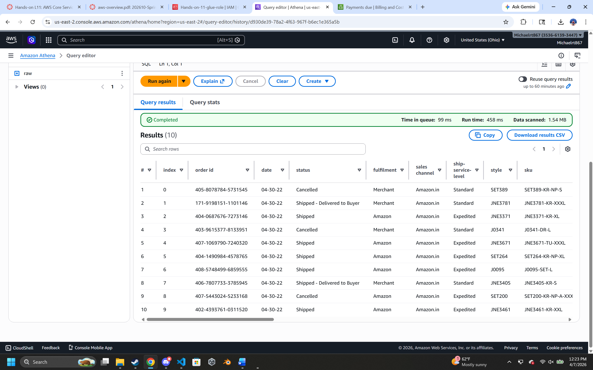

# Readme of Hands on L11

**Cloudwatch Screenshot located below**
[Cloudwatch Screenshot](photos/cloudwatch-crawler.png)

**Query 1 Screenshot**

SQL Code Created below
```
SELECT * FROM "output_db"."raw" limit 10;
```
<br>

**Query 2 Screenshot**

SQL Code Created below
```
SELECT distinct(category), 
count("category")
FROM "output_db"."raw"
GROUP BY 
category
limit 10;
```
<br>

**Query 3 Screenshot***


SQL Code Created below
```
SELECT distinct(fulfilment),
count("order id") as "Number of Orders", 
sum("qty") as "Items sold", 
sum("amount") as "Revenue"
FROM "output_db"."raw"
WHERE "status" != 'Cancelled' and "order id" != 'Pending'
GROUP by
fulfilment
Order by "Revenue" DESC
limit 10;
```
<br>


