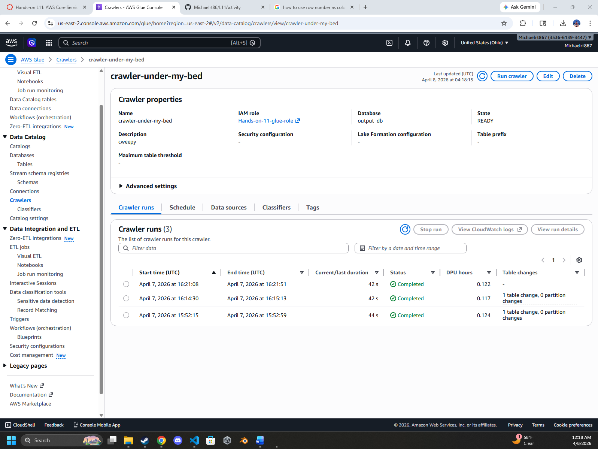
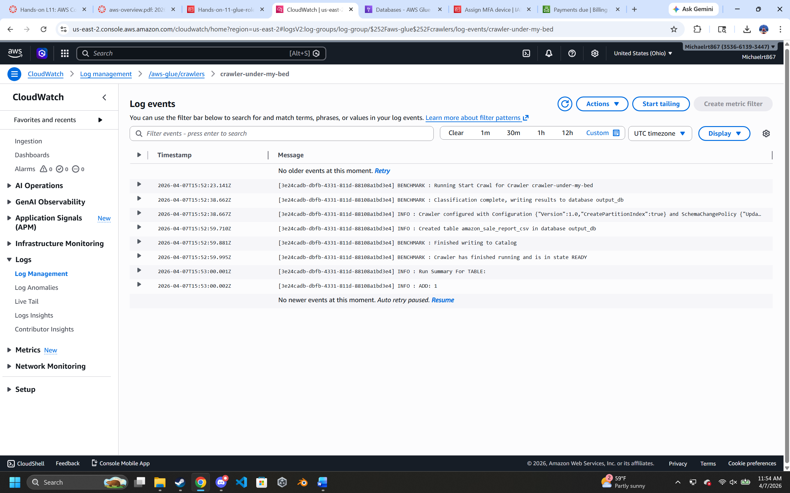
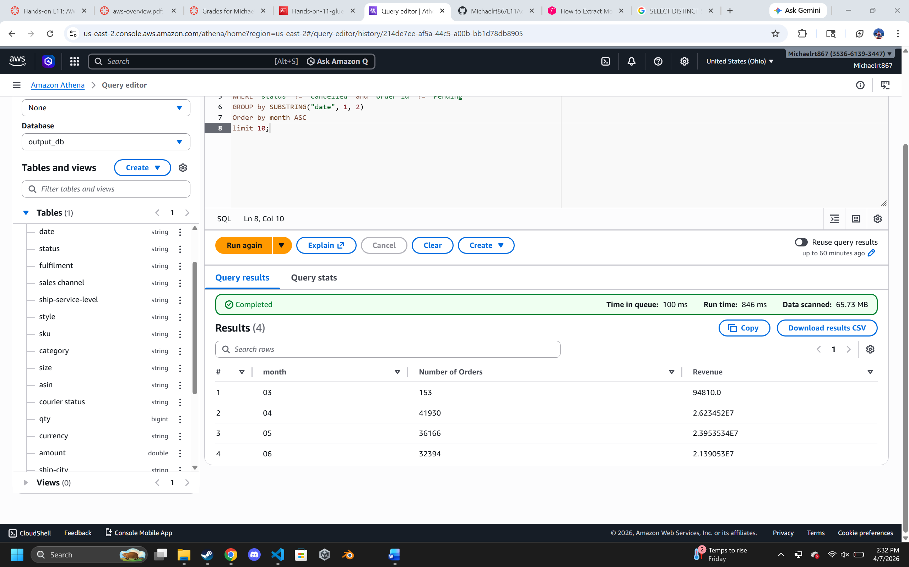
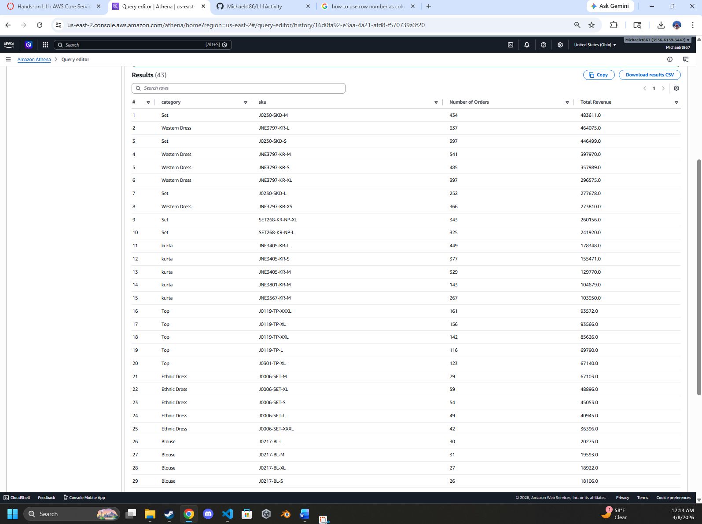

# Readme of Hands on L11

**Setting up Crawler**

Setting up the crawler was not the hardest thing to do when I had to go through set the properties, use the S3 data source previously created that had the CSV data inputted. We then chose the role created through the IAM process, set the target database then set the Crawler to be scheduled "on demand". After that we were able to finish and create our Crawler!  

**Cloudwatch Screenshot located below**


**Query 1 Screenshot**

SQL Code created below
```
SELECT * FROM "output_db"."raw" limit 10;
```
<br>

**Query 2 Screenshot**

SQL Code created below
```
SELECT distinct(category), 
count("category")
FROM "output_db"."raw"
GROUP BY 
category
limit 10;
```
<br>

**Query 3 Screenshot***


SQL Code Created below
```
SELECT distinct(fulfilment),
count("order id") as "Number of Orders", 
sum("qty") as "Items sold", 
sum("amount") as "Revenue"
FROM "output_db"."raw"
WHERE "status" != 'Cancelled' and "order id" != 'Pending'
GROUP by
fulfilment
Order by "Revenue" DESC
limit 10;
```
<br>

**Query 4 Screenshot**


SQL Code created below
```
SELECT SUBSTRING("date", 1, 2) as month,
count("order id") as "Number of Orders",
sum("amount") as "Revenue"
FROM "output_db"."raw" 
WHERE "status" != 'Cancelled' and "order id" != 'Pending'
GROUP by SUBSTRING("date", 1, 2)
Order by month ASC
limit 10;
```
<br>

**Query 5**

**Screenshot for Query 5 


SQL Code created below (Co-pilot assisted)
```
SELECT category, sku, "Number of Orders", "Total Revenue"
FROM (
    SELECT 
        category, 
        sku, 
        COUNT("order id") AS "Number of Orders",
        SUM("amount") AS "Total Revenue",
        ROW_NUMBER() OVER (
            PARTITION BY category 
            ORDER BY SUM("amount") DESC
        ) AS rn
    FROM "output_db"."raw"
    WHERE "status" != 'Cancelled' 
      AND "status" != 'Pending' 
      AND qty >= 1
    GROUP BY sku, category
) ranked_skus
WHERE rn <= 5
ORDER BY "Total Revenue" DESC;
```